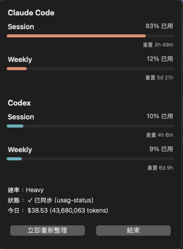
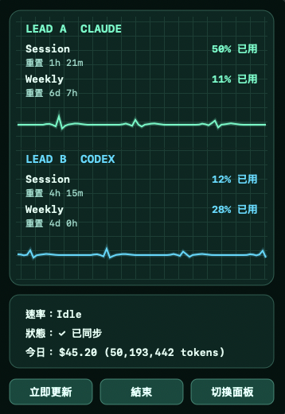
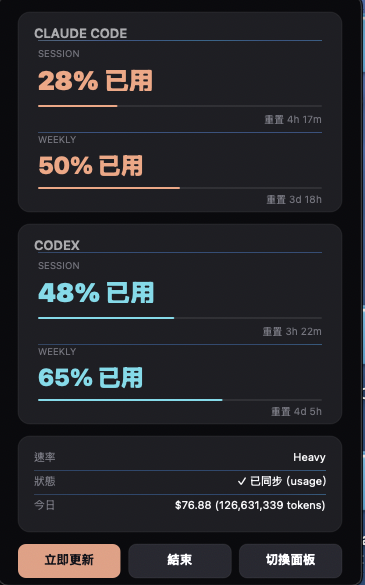
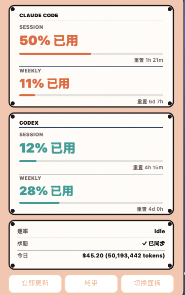

# Usage Monitor

A multi-platform usage monitor for Claude Code and Codex on macOS, Windows, and Web.

[繁體中文](README.md) · English

[](https://github.com/yanowo/usage/actions/workflows/check.yml)
[](https://github.com/yanowo/usage/releases/latest)
[](https://www.python.org/)
[](README.en.md)
[](LICENSE)

**Usage Monitor** is a local usage monitor for **Claude Code** and **Codex**. It shows 5-hour usage, weekly usage, today's token count, and cost estimates.

The project / package short name is `usage-monitor`. For compatibility with existing installs, Claude hook files, status files, and Python modules keep their `usage-*` / `usage_*` names.

The current fork supports three primary surfaces:

- **macOS**: a menu bar app with a full popover panel.
- **Windows**: a draggable desktop widget with topmost mode, opacity, Mini mode, status-strip mode, and external-monitor dragging.
- **Web**: a local HTTP page and JSON API for browsers, desktop widgets, Rainmeter-style tools, and embedded panels.

This project is based on the upstream [aqua5230/usage](https://github.com/aqua5230/usage). If you fork, modify, or redistribute it, keep the upstream project link and attribution.

<p align="center">
  
</p>

## Highlights

- Reads usage locally; it does not call the Anthropic or OpenAI APIs.
- Claude Code usage comes from the official `statusLine` JSON `rate_limits`.
- Codex usage comes from `rate_limits` and token records in `~/.codex/sessions/**/*.jsonl`.
- macOS ships six native panels: Default, Taiwan usage monitor, Matrix, ECG, Minimal, and Sketch.
- Windows desktop mode supports `All / Claude / Codex`, opacity, topmost mode, Mini mode, status-strip mode, and multi-monitor dragging.
- Web mode supports `Full / Compact / Wide`, `All / Claude / Codex`, light/dark theme, and `/api/usage`.
- Mock mode previews the UI without installing the Claude hook first.

## Data Sources

### Claude Code

Claude Code data comes from the official `statusLine` hook. Usage Monitor installs `usage_statusline.py` to `~/.claude/usage-statusline.py` and updates `~/.claude/settings.json`:

```json
{
  "statusLine": {
    "type": "command",
    "command": "python3 ~/.claude/usage-statusline.py",
    "refreshInterval": 1
  }
}
```

Whenever Claude Code refreshes its status line, it pipes the current session JSON to the hook. The hook only writes that JSON to `~/.claude/usage-status.json`. Usage Monitor then reads:

- `rate_limits.five_hour.used_percentage`
- `rate_limits.seven_day.used_percentage`
- `rate_limits.*.resets_at`
- `context_window`
- `cost`

If multiple Claude status files exist, Usage Monitor selects the newest snapshot that contains quota data:

1. `~/.claude/usage-status.json`
2. `~/.claude/usag-status.json`, legacy fallback
3. `~/.claude/tt-status.json`, token-tracker compatibility fallback

`/usage` is an interactive Claude Code command, not a stable JSON API. This project does not scrape `/usage` screen text.

### Codex

Codex CLI does not expose a Claude-style statusLine hook, so Usage Monitor scans:

```text
~/.codex/sessions/**/*.jsonl
```

When Codex logs contain `rate_limits`, Usage Monitor maps windows as follows:

- `window_minutes=300`: 5-hour quota
- `window_minutes=10080`: weekly quota

Today's token count and cost estimate are summed from the same session logs. If Codex is not installed, the session directory does not exist, or no `rate_limits` records exist yet, the Codex section displays empty data without affecting Claude.

### Cost Estimates

Usage percentages do not require network access. Cost estimates may download the public LiteLLM pricing JSON when no local cache exists, then store it at:

```text
~/.claude/pricing_cache.json
```

If the download fails, a built-in fallback price table is used. Quota percentages are unaffected.

## Requirements

- macOS or Windows
- Python 3.13+
- Claude Code installed and signed in
- Codex CLI optional

Windows desktop mode requires Python with Tkinter. If Tkinter is unavailable, use Web mode.

## Quick Start

### 1. Clone

```bash
git clone https://github.com/yanowo/usage.git usage-monitor
cd usage-monitor
```

For the original upstream project, use [aqua5230/usage](https://github.com/aqua5230/usage).

### 2. Create The Environment

macOS:

```bash
python3 -m venv .venv
source .venv/bin/activate
pip install -e .
```

Windows PowerShell:

```powershell
py -3.13 -m venv .venv
.\.venv\Scripts\Activate.ps1
pip install -e .
```

### 3. Install The Claude Code Hook

Run this once when using the source tree:

```bash
python3 main.py --setup
```

Windows PowerShell:

```powershell
python main.py --setup
```

After setup, fully restart Claude Code so it reloads `~/.claude/settings.json`. The first statusLine refresh after restart is when `~/.claude/usage-status.json` gets updated.

Uninstall the hook:

```bash
python3 main.py --unsetup
```

Windows PowerShell:

```powershell
python main.py --unsetup
```

## Run Modes

### macOS Menu Bar

macOS defaults to the menu bar app:

```bash
source .venv/bin/activate
python3 main.py
```

The status item appears in the top-right menu bar. Click it to open the full popover with Claude / Codex quota rows, rate, sync status, today's tokens, and cost estimate.

Built-in panels:

- **Default**: two quota cards and a footer status card.
- **Taiwan usage monitor**: red-and-white theme with a Taiwan header.
- **Matrix**: black-and-green digital-rain animation.
- **ECG**: medical monitor style with live Claude / Codex waveforms.
- **Minimal**: dark minimal UI.
- **Sketch**: hand-drawn Excalidraw-style UI.

<p align="center">
  
  
  
  
  
  
</p>

If you use a packaged `.app`, macOS Gatekeeper may block the first launch. In Finder, Ctrl-click `usage.app`, choose Open, then confirm.

### Windows Desktop

Windows defaults to the desktop widget:

```powershell
.\.venv\Scripts\Activate.ps1
python main.py
```

You can also request it explicitly:

```powershell
python main.py --desktop
```

Desktop widget features:

- `All / Claude / Codex` product switching
- `Refresh` manual refresh
- `Pinned / Pin` topmost toggle
- `Alpha` opacity control
- `Mini` single-product compact card
- `_` status-strip mode; the strip is draggable and supports external monitors
- `Style` switching across Classic / Taiwan / Matrix / ECG / Minimal / Sketch

To launch without keeping a PowerShell window open, create a shortcut that uses `pythonw.exe`:

```powershell
E:\usage-monitor\.venv\Scripts\pythonw.exe E:\usage-monitor\main.py --desktop
```

Replace the path with your actual checkout path.

### Web

Web mode starts a local HTTP server:

```bash
python3 main.py --web
```

Windows PowerShell:

```powershell
python main.py --web
```

Default URLs:

- `http://127.0.0.1:8765/`
- `http://127.0.0.1:8765/?layout=compact`
- `http://127.0.0.1:8765/?layout=horizontal`
- `http://127.0.0.1:8765/api/usage`

Run with explicit host and port:

```bash
python3 main.py --web --host 127.0.0.1 --port 8765
```

To expose it to other devices on the same LAN:

```bash
python3 main.py --web --host 0.0.0.0 --port 8765
```

Check your firewall and network security before exposing it. The default bind address is `127.0.0.1`, which only accepts local connections.

Supported URL parameters:

- `?product=all`
- `?product=claude`
- `?product=codex`
- `?layout=full`
- `?layout=compact`
- `?layout=horizontal`
- `?theme=dark`
- `?theme=light`

For desktop widgets, start with:

```text
http://127.0.0.1:8765/?layout=compact
```

or the wide layout:

```text
http://127.0.0.1:8765/?layout=horizontal
```

### TUI

Terminal UI:

```bash
python3 main.py --tui
```

Windows PowerShell:

```powershell
python main.py --tui
```

<p align="center">
  
</p>

Press `Ctrl+C` to exit.

## Mock Preview

Use `--mock` to preview UI without installing the hook:

```bash
python3 main.py --mock
python3 main.py --web --mock
python3 main.py --desktop --mock
python3 main.py --tui --mock
```

Windows PowerShell:

```powershell
python main.py --desktop --mock
python main.py --web --mock
```

## CLI Options

| Option | Description |
|--------|-------------|
| `--setup` | Install the Claude Code statusLine hook |
| `--unsetup` | Remove the hook and restore the previous statusLine setting |
| `--desktop` | Start the desktop widget |
| `--web` | Start the Web UI and JSON API |
| `--host HOST` | Web bind address, default `127.0.0.1` |
| `--port PORT` | Web port, default `8765` |
| `--tui` | Start the terminal TUI |
| `--interval N` | Data refresh interval, minimum 30 seconds, default 60 |
| `--mock` | Use fake data for previews |
| `--force-group {0,1,2,3}` | TUI test option; forces the rate group |

## `.env` Configuration

`main.py` loads `.env` from the current working directory first, then from the project directory. Command-line flags still override `.env`.

Supported variables:

| Variable | Description |
|----------|-------------|
| `USAGE_MODE` | Default mode: `web`, `desktop`, or `tui` |
| `USAGE_WEB_HOST` | Web bind address; the source default is `DEFAULT_WEB_HOST` in `usage_web.py` |
| `USAGE_WEB_PORT` | Web port; the source default is `DEFAULT_WEB_PORT` in `usage_web.py` |
| `USAGE_INTERVAL` | Data refresh interval, minimum 30 seconds |
| `USAGE_MOCK` | Set `1` to enable mock mode, `0` to disable |
| `USAGE_DEBUG` | Set `1` to show debug logs |
| `USAGE_CODEX_COMMAND` | Path to a specific Codex executable |
| `USAGE_FORCE_GROUP` | TUI test rate group, `0` through `3` |

See `.env.example`:

```env
USAGE_MODE=web
USAGE_WEB_HOST=0.0.0.0
USAGE_WEB_PORT=8765
USAGE_INTERVAL=60
USAGE_MOCK=0
```

Platform defaults:

- Windows: `python main.py` starts desktop mode.
- macOS: `python3 main.py` starts menu bar mode.
- Other platforms: `python3 main.py` falls back to Web mode.

## Start On Login

### macOS LaunchAgent

```bash
./scripts/install-launchagent.sh
```

Logs:

```text
~/Library/Logs/usage/usage.log
~/Library/Logs/usage/usage.err.log
```

Uninstall:

```bash
./scripts/uninstall-launchagent.sh
```

### Windows

Create a shortcut in the Windows Startup folder:

```powershell
E:\usage-monitor\.venv\Scripts\pythonw.exe E:\usage-monitor\main.py --desktop
```

For Web mode:

```powershell
E:\usage-monitor\.venv\Scripts\pythonw.exe E:\usage-monitor\main.py --web
```

## Packaging

### macOS `.app`

```bash
./scripts/build_app.sh
```

Output:

```text
dist/usage.app
```

### Windows `.exe`

```powershell
powershell -ExecutionPolicy Bypass -File .\scripts\build_windows_exe.ps1
```

Output:

```text
dist\usage.exe
```

## Development

Install development tools:

```bash
pip install pytest ruff mypy
```

Run checks:

```bash
pytest
ruff check .
mypy .
```

Windows PowerShell:

```powershell
.\.venv\Scripts\python.exe -m pytest
.\.venv\Scripts\ruff.exe check .
.\.venv\Scripts\mypy.exe .
```

## Troubleshooting

| Problem | Likely Cause | Fix |
|---------|--------------|-----|
| Claude shows `--` | Hook not installed, or Claude Code has not refreshed statusLine yet | Run `python main.py --setup`, restart Claude Code, then wait for one refresh |
| Claude shows 0%, but `/usage` looks non-zero | Local `usage-status.json` is still an old snapshot, or the current IDE entrypoint is not refreshing statusLine | Restart native Claude Code and confirm `~/.claude/settings.json` contains `refreshInterval: 1` |
| Status says stale / not updated | Claude Code has not written a fresh statusLine JSON for a while | Open Claude Code and trigger one response or statusLine refresh |
| Codex section has no data | No `~/.codex/sessions`, or logs do not contain `rate_limits` yet | Run one Codex conversation, then refresh |
| Windows desktop widget does not appear | Tkinter is unavailable, or the environment cannot open a GUI | Use `python main.py --web`, or install Python with Tkinter |
| Web URL does not open | Server is not running, port is occupied, or host does not match | Run `python main.py --web` again and use the printed URL |
| Today's cost is `$0.00` | No cost record, pricing cache failed, or model name cannot be mapped | Delete `~/.claude/pricing_cache.json` and refresh, or run with `USAGE_DEBUG=1` |
| macOS `.app` will not open | Gatekeeper blocked the unsigned app | Ctrl-click `usage.app` in Finder, choose Open, then confirm |

## Debugging

Enable debug logging:

```bash
USAGE_DEBUG=1 python3 main.py
```

Windows PowerShell:

```powershell
$env:USAGE_DEBUG="1"
python main.py --web
```

Useful checks:

```bash
cat ~/.claude/settings.json
cat ~/.claude/usage-status.json
```

Windows PowerShell:

```powershell
Get-Content -Raw $env:USERPROFILE\.claude\settings.json
Get-Content -Raw $env:USERPROFILE\.claude\usage-status.json
```

## Privacy And Network

- Does not read macOS Keychain.
- Does not call the Anthropic API.
- Does not call the OpenAI API.
- Claude quota comes from Claude Code statusLine JSON.
- Codex quota comes from local Codex session logs.
- The only expected network access is downloading the public LiteLLM pricing JSON for cost estimates, which is cached.
- Web mode binds to `127.0.0.1` by default.

## Credits, License, And Upstream

This fork is based on the original `usage` project and extends it with Windows desktop mode, Web server mode, cross-platform CLI routing, Windows packaging, and multi-monitor widget behavior.

| Item | Link |
|------|------|
| Original author / upstream project | [lollapalooza · aqua5230/usage](https://github.com/aqua5230/usage) |
| This fork | [yanowo/usage](https://github.com/yanowo/usage) |
| License in this fork | [MIT License](LICENSE) |

> If you fork, modify, or redistribute this project, keep this attribution and the upstream project link.
